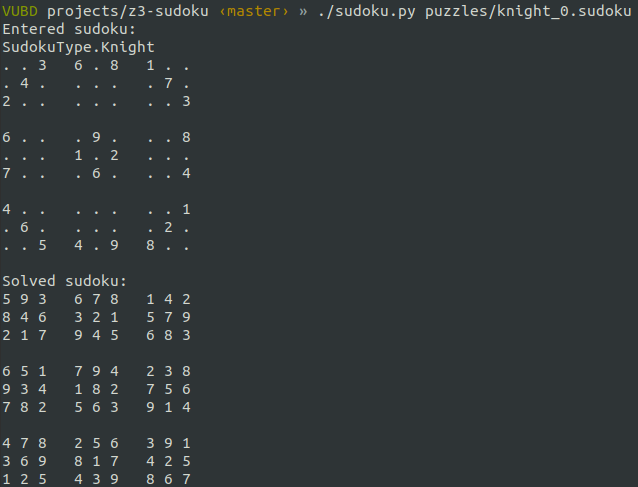

# Z3 Sudoku

A sudoku solver using [Z3 Theorem Prover](https://github.com/Z3Prover/z3).



## Supported Sudoku Types

* **[Classic](#classic-sudoku)** (This is the regular sudoku with no extra constraints)
* **[Chess](#chess-sudoku-types)** (Knight, King, and Queen)
* **[Miracle](#miracle-sudoku)** (No consecutive neighbors + King + Knight)
* **[Thermo](#thermo-sudoku)** (Cells on thermometer must be increasing)
* **[Sandwich](#sandwich-sudoku)** (Hints provided are the sums between the one and the nine in row/column)
* **[Killer](#killer-sudoku)** (Cages have sums with no repeating digits)
* Any combination of the above (see section [Sudoku File Format](#sudoku-file-format) below)

## Usage

First install the Python wrapper for Z3 from pypi using the command

```bash
pip3 install z3-solver
```

Then just pass in the sudoku puzzle file as the only argument

```bash
python3 sudoku.py puzzles/thermo_0.sudoku
```

## Sudoku File Format

The `.sudoku` file provided to the script should be formatted as described:

* A regular ASCII formatted text file
* Whitespaces (newline, space, tab, etc) are ignored
* The first 81 characters (excluding whitespaces) should contain the known digits [0-9] and a dot `.` in places of an empty/unknown cell.
* An optional semicolon `;` separated list of zero or more constraints to apply (trailing semicolon optional)
* Letters in constraints are case-insesitive (I think)

Each constraint is formatted as: `<TYPE><OPTIONS>`  
The miracle and the chess constraints take no options and are applied to the entire grid.  

Example sudoku files can be found in the `puzzles/` directory.  

### Classic Sudoku

Empty constraints list.  
No extra constraints applied in addition to the basic sudoku rules (Classic sudoku)

### Thermo Sudoku

In a thermo sudoku, there are these thermometers drawn from one cell to another.  
Digits on these thermometers must increase from the bulb end to the other end (doesn't have to be consecutive).  

Type is `T`, which is followed by a list of pairs of digits representing the row-column numbers in the order of the thermometer.  
**Note: Row and column numbers start from 1 (as opposed to 0) and from the top left corner.**

Example:  
For the given thermo sudoku below (from https://maybepuzzles.com/types/thermo-sudoku/)  
  

The top-left thermometer starts from row 2 column 1 (2,1) and continues to (1,2) (2,3) (3,2), which would result in the constraint string `T21232332`  
(also can be written as `T 21 12 23 32` since whitespaces are ignored)  

The bottom-right thermometer is then `T98877889`  

The resulting sudoku file then looks like:
```
... .2.
... 5.1

... .6.
.4. ...

5.3 ...
.2. ...
T21232332;
T98877889
```   
(I just realized this isn't a full 9-by-9 sudoku, but hopefully you get the idea)

### Chess Sudoku Types

Type is `KN`, `Q`, or `K` depending on whether it's knight, queen, or king, respectively.  
No extra options are needed.  

Example:  
(from `puzzles/knight_0.sudoku`)
```
..3 6.8 1..
.4. ... .7.
2.. ... ..3

6.. .9. ..8
... 1.2 ...
7.. .6. ..4

4.. ... ..1
.6. ... .2.
..5 4.9 8..
KN
```

### Miracle Sudoku

Miracle sudoku is a combination of what I call "consecutive neighbors" + knight + king constraints.  
This means that, on top of the knight's and king's constraints, "any two orthogonally adjacent cells cannot contain consecutive digits."  
Similarly to the [chess constraints](#chess-sudoku-types) above, no extra options are needed.

Example:  
(from `puzzles/miracle_0.sudoku`)  
```
... ... ...
... ... ...
... ... ...

... ... ...
..1 ... ...
... ... 2..

... ... ...
... ... ...
... ... ...
M
```

### Sandwich Sudoku

In a sandwich sudoku, there are hints provided outside of the grid next to a row or a column.  
These hints are the sums of the digits between the `1` and the `9` in that corresponding row or column, referred to as the "sandwich sum".

The type is `S`, combined with either `R` or `C` for row or column, respectively.  
Then comes the row/column number from 1 to 9, followed by the sandwich sum.

Example:  
For the given sandwich sudoku below (from http://www.clarity-media.co.uk/puzzleblog/sandwich-sudoku-puzzles)  


Row 1 has the sandwich sum of `2`, which can be written as `SR12`.  
Column 5 has the sandwich sum of `26`, which can be written as `SC526`.

### Killer Sudoku

In a killer sudoku, the cells are enclosed in a cage, where the digits cannot repeat and sum up to the "cage sum" hint given in the top left corner.  

The type is `C`, which is followed by the sum (0 padded two digits; 1 is 01, 7 is 07, 45 is 45) and then the list of the cells in the cage, in the form of row-column number pairs, similarly to the [thermo constraints](#thermo-sudoku)  
**Note: Row and column numbers start from 1 (as opposed to 0) and from the top left corner.**

Example:  
For the given killer sudoku below (from https://www.killersudokuonline.com/play.html?puzzle=D3s4r2g5463&year=2020)  


The top-left cage sums up to 11 and contains cells (1,1) and (2,1), which is written as `C11 11 21`  
The 7 cage in boxes 8 and 9 is then `C07 87 97 96`

## TODO

These are some of the features I want to add:
* Better display of input puzzle (how to show the extra constraints)
* Option to find ALL possible solutions (helpful for puzzle creation in verifying unique solution)
* Probably optimize some of the constraints using [Z3 functions](https://rise4fun.com/z3/tutorialcontent/guide#h23)
* Show steps (possible to do with Z3?)

## References 'n Stuff

* Original work from Giuseppe Cardone's [blog post](https://www.gcardone.net/2020-06-03-solving-the-miracle-sudoku-in-z3/)
* Similar work [Solving Sudoku Puzzles By Algorithms](https://github.com/ppmx/sudoku-solver)
* Similar project by me to solve another sudoku-like puzzles [Jane Street Puzzles - Dec 2020](https://git.bhong.dev/brian/jane-street-puzzles/-/tree/master/2020_December)
* [Z3 - Guide](https://rise4fun.com/z3/tutorialcontent/guide)
* [Programming Z3](https://theory.stanford.edu/~nikolaj/programmingz3.html) (Python)
